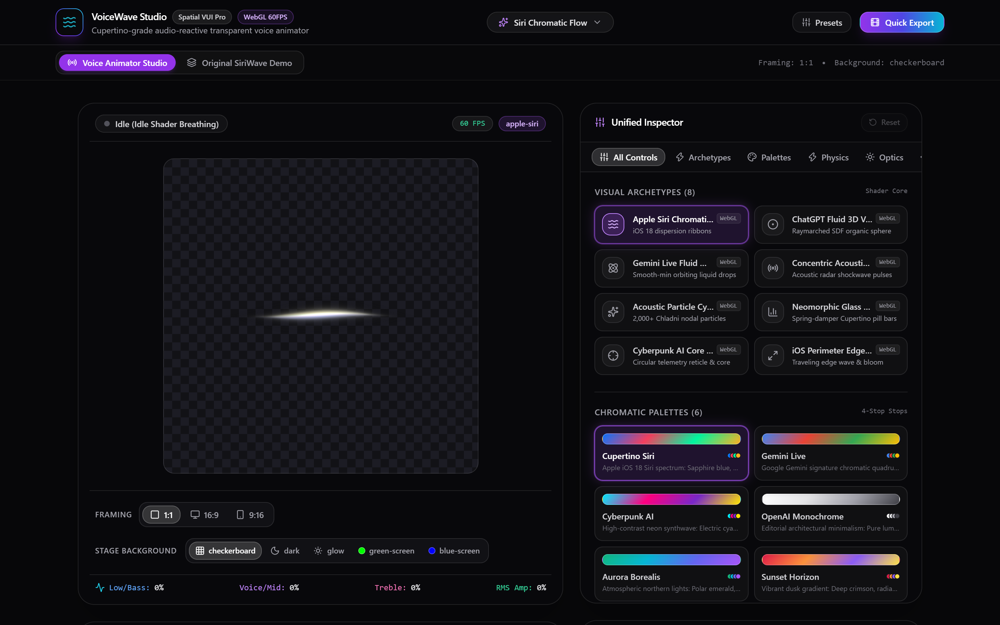
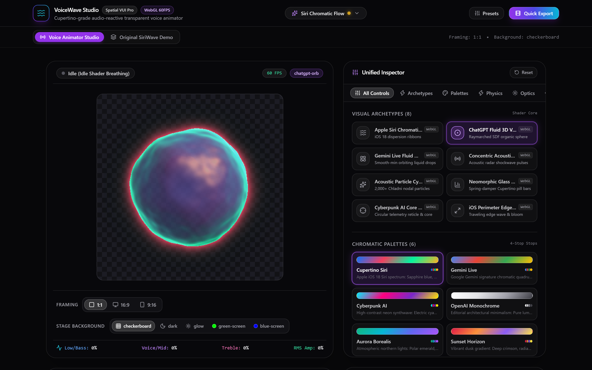
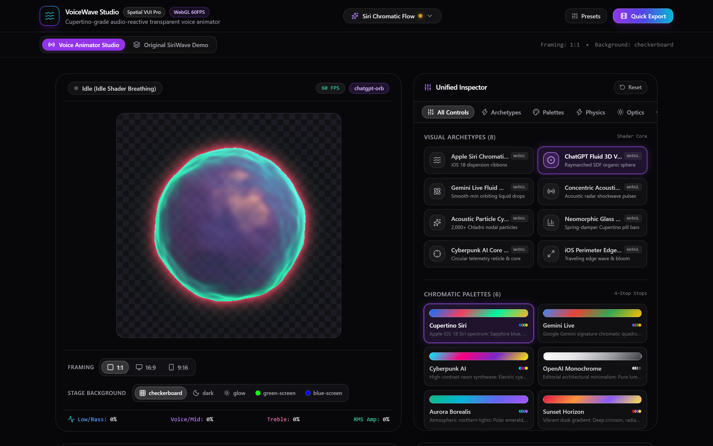
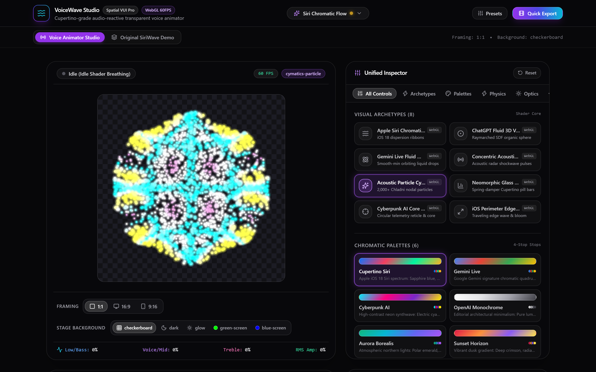
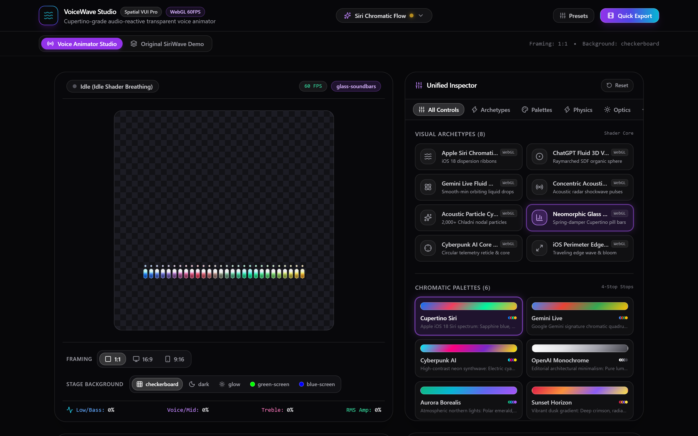
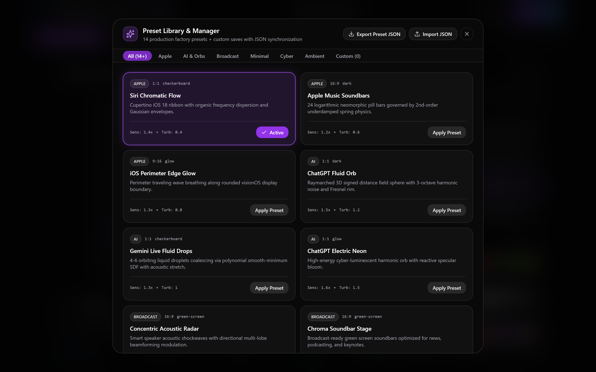

# VoiceWave Studio

<div align="center">


### Commercial-Grade Apple & visionOS Voice User Interface (VUI) Animation Studio

An Apple-grade web application for generating, previewing, and rendering broadcast-quality, transparent Voice User Interface (VUI) animations synced to speech and audio with sample-accurate ballistics.

[](https://react.dev)
[](https://www.typescriptlang.org)
[](https://vitejs.dev)
[](https://tailwindcss.com)
[](https://www.khronos.org/webgl/)
[](https://vitest.dev)
[](https://playwright.dev)
[](LICENSE)

<br />



<br />

[Features](#-key-features) • [Visual Archetypes](#-8-vui-visual-archetypes) • [Audio DSP Engine](#-audio-dsp--ballistics-engine) • [Export Pipeline](#-multi-engine-transparent-export-pipeline) • [Quickstart](#-quickstart) • [Architecture](#-project-architecture)

</div>

---

## 🌟 Overview

**VoiceWave Studio** transforms any voice, speech, or audio track into liquid, organic Voice User Interface (VUI) animations. Designed specifically for video creators, podcast editors, AI agent developers, and motion designers who require **true backgroundless transparency** (`alpha > 0`) that composites seamlessly in Adobe Premiere Pro, Final Cut Pro, DaVinci Resolve, or web applications without black halos or fringe artifacts.

Built with **React 19**, **WebGL 2.0**, **Direct Form II Transposed Biquad Filters**, and hardware-accelerated **WebCodecs**.

---

## ✨ Key Features

- **8 Researched VUI Visual Archetypes**: High-performance WebGL GLSL shaders and Canvas 2D renderers replicating cutting-edge voice interfaces from Apple, OpenAI, and Google.
- **Precision 3-Band Audio DSP**: Sub-bass (280 Hz), Vocal Presence (1,200 Hz), and Sibilant Treble (3,200 Hz) isolation via authentic biquad filters.
- **<10ms Plosive Attack & $C^1$ Velocity Ballistics**: Dual-pole liquid envelope follower providing instantaneous vocal response with silky exponential decay.
- **Apple visionOS Frosted Glass UI**: Translucent glassmorphism (`backdrop-blur-2xl`), hairline specular borders, and spring-damper controls.
- **Responsive Aspect Ratio Framing**: Instant canvas switching between **1:1 Square**, **16:9 Landscape (YouTube)**, and **9:16 Portrait (Shorts / TikTok / Reels)**.
- **5 Stage Verification Backgrounds**: Transparent Checkerboard, Clean Dark Studio, Ambient Glow, Green Screen (`#00FF00`), and Blue Screen (`#0000FF`).
- **14 Production Factory Presets**: Curated styles across Minimalist, Organic, Cyberpunk, and High-Energy categories + LocalStorage persistence and JSON import/export.
- **Multi-Format Broadcast Exporter**:
  - **Apple ProRes 4444 (`.mov`)**: 12-bit/10-bit alpha (`yuva444p10le`), profile 4, uncompressed 16-bit PCM audio.
  - **WebM VP9 Alpha (`.webm`)**: Native in-browser WebCodecs encoding with `alpha: "keep"` and Opus audio.
  - **Transparent PNG Sequence (`.zip`)**: Lossless numbered PNG frames + synchronized WAV audio stream-compressed via `fflate`.
  - **Chroma Key MP4 (`.mp4`)**: Solid green/blue backdrop rendering for traditional editing suites.
- **Zero-Drift Offline Rendering**: Deterministic frame-by-frame synthesis locked to exact audio sample positions.

---

## 🎨 8 VUI Visual Archetypes

| Archetype | Description | Technology | Preview |
| :--- | :--- | :--- | :--- |
| **Apple Siri Chromatic Wave (iOS 18)** | 5 multi-harmonic sine waves with chromatic aberration (Sapphire, Mint, Magenta, Amber) and vocal bloom. | WebGL GLSL Fragment Shader | *(Hero Preview Above)* |
| **ChatGPT Fluid 3D Voice Orb** | Raymarched organic sphere with 3D simplex noise displacement, subsurface luminescence, and breathing. | WebGL Raymarching Shader | [View Screenshot](docs/screenshots/archetype-chatgpt-orb.png) |
| **Gemini Live Fluid Metaballs** | 4 multi-colored liquid drops that orbit in idle state and coalesce into an elastic blob driven by speech. | WebGL 2D Distance Field | [View Screenshot](docs/screenshots/archetype-gemini-metaballs.png) |
| **Concentric Acoustic Rings** | Smooth pulsing acoustic radar shockwaves expanding outward with harmonic decay. | WebGL Radial Shockwave Shader | Vector Wavefronts |
| **Acoustic Particle Cymatics** | 3,072+ point-sprite particles forming Ernst Chladni 2D nodal standing wave resonance patterns. | WebGL Point-Sprite GPU System | [View Screenshot](docs/screenshots/archetype-cymatics.png) |
| **Neomorphic Glass Soundbars** | 28 Apple Music pill bars driven by 2nd-order underdamped spring-damper equations with glass sheen. | Canvas 2D / Physical Spring Simulation | [View Screenshot](docs/screenshots/archetype-soundbars.png) |
| **Cyberpunk AI Core / Sci-Fi HUD** | Concentric circular reticles with live oscilloscope waveform rings and frequency counters. | Canvas 2D Vector Reticle Engine | Oscilloscope Reticle |
| **iOS Perimeter Edge Glow** | Ethereal chromatic gradient breathing along the display perimeter, pulsing to vocal transients. | WebGL Screen-Space Perimeter Shader | Border Glow |

### 📸 Visual Archetypes Gallery

<div align="center">
<table>
  <tr>
    <td align="center" width="50%">
      <b>ChatGPT Fluid 3D Voice Orb</b><br/>
      
    </td>
    <td align="center" width="50%">
      <b>Gemini Live Fluid Metaballs</b><br/>
      
    </td>
  </tr>
  <tr>
    <td align="center" width="50%">
      <b>Acoustic Particle Cymatics</b><br/>
      
    </td>
    <td align="center" width="50%">
      <b>Neomorphic Glass Soundbars</b><br/>
      
    </td>
  </tr>
</table>

<b>visionOS Preset Manager (14 Factory Presets & JSON Import/Export)</b><br/>


</div>

---

## 🔬 Audio DSP & Ballistics Engine

```
[ Audio Source ] (Microphone, File Upload, Sample Voice)
       │
       ▼
[ Web Audio Context ] / [ OfflineAudioContext ]
       │
       ├───────────────────────────────────────────────┐
       ▼                                               ▼
[ Biquad Filter Bank (DF-II Transposed) ]       [ RMS Energy Detector ]
  ├── Low-Pass (280 Hz, Q=0.707)                  └── O(1) Prefix Sums
  ├── Band-Pass (1,200 Hz, Q=1.2)
  └── High-Pass (3,200 Hz, Q=0.707)
       │
       ▼
[ Dual-Pole Liquid Follower Bank ]
  ├── Pole 1: Fast Plosive Attack (τ₁ = 2.0ms, rise < 10ms)
  └── Pole 2: Critically Damped Exponential Release (τ₂ = 180ms, C¹ continuity)
       │
       ▼
[ FrameData Telemetry (low, mid, high, amp, phase) ]
       │
       ▼
[ WebGL Shaders & Canvas Visualizers (60 FPS) ]
```

- **Direct Form II Transposed Equations**: Matches IEEE 754 float precision, completely resilient against NaN/infinities and denormal underflows.
- **Unified Engine**: The live runtime analyzer ([`useAppStore.ts`](src/store/useAppStore.ts)) and the offline export processor ([`OfflineDSP.ts`](src/audio/OfflineDSP.ts)) execute the exact same DSP mathematics, guaranteeing zero visual drift between live preview and exported video.

---

## 🎬 Multi-Engine Transparent Export Pipeline

### 1. Apple ProRes 4444 (`.mov`)
- **Pixel Format**: `yuva444p10le` (10/12-bit broadcast alpha channel)
- **Profile**: Apple ProRes 4444 (Profile 4)
- **Audio**: Uncompressed 16-bit 48kHz Stereo PCM
- **Converter Engine**: Local high-speed Node.js FFmpeg bridge server (`converter-server.js` or built-in Vite middleware on `/api/convert-prores`).
- **NLE Compatibility**: Native drag-and-drop in Apple Final Cut Pro, Adobe Premiere Pro, and DaVinci Resolve.

### 2. WebM VP9 Alpha (`.webm`)
- **Encoding**: Browser-native WebCodecs `VideoEncoder` with `alpha: "keep"`
- **Container**: WebM muxed via `webm-muxer`
- **Audio**: Opus 48kHz stereo
- **Footprint**: Ultra-compact file sizes with full alpha transparency.

### 3. Transparent PNG Sequence (`.zip`)
- **Format**: Individual 32-bit RGBA lossless PNG frames (`frame_00001.png`, ...)
- **Audio**: Synchronized `audio.wav` (16-bit 48kHz PCM)
- **Compression**: Asynchronous stream-compression using `fflate` ($O(1)$ memory usage, zero heap bloat)
- **Documentation**: Includes `README_NLE_IMPORT.txt` with step-by-step import instructions for all major NLEs.

### 4. Chroma Key MP4 (`.mp4`)
- **Codec**: H.264 / AAC High Profile
- **Backing**: Solid Green (`#00FF00`) or Solid Blue (`#0000FF`)
- **Use Case**: Quick compositing using standard Ultra Key or 3D Keyer tools in any video editor.

---

## 🚀 Quickstart

### Prerequisites
- **Node.js**: `v18.0.0` or later
- **npm**: `v9.0.0` or later
- **FFmpeg** *(Optional, required for ProRes 4444 `.mov` export)*: Ensure `ffmpeg` is available on your system `PATH`.

### 1. Clone & Install
```bash
git clone https://github.com/AiPersonacademy/voicewave-studio.git
cd voicewave-studio
npm install
```

### 2. Run Development Server
```bash
npm run dev
```
Open **[http://localhost:5174](http://localhost:5174)** in your browser.

### 3. (Optional) Run Local ProRes Converter Server
If running outside the Vite development middleware:
```bash
npm run server:converter
```
The converter server will listen on `http://localhost:5175`.

---

## 🧪 Testing & Verification

VoiceWave Studio is backed by a comprehensive 2-tier testing matrix:

### Unit Tests (Vitest)
Executes 223 unit and adversarial stress tests in <10 seconds:
```bash
npm run test:unit
```
Covers:
- Mathematical frequency response curves of the Biquad Filter Bank.
- Rise times (<10ms) and $C^1$ velocity continuity of the DualPoleFollower.
- NaN input sanitization and anti-denormal clamping.
- WebGL shader deallocation, context loss recovery, and zero memory leaks.
- 14 factory preset schema validations and LocalStorage quota exhaustion resilience.
- Stream-compression and telemetry calculations.

### End-to-End Tests (Playwright)
Executes cross-browser automated tests using headless Chromium with SwiftShader WebGL:
```bash
npm run test:e2e
```
Covers:
- **Tier 1**: Complete feature coverage across all 8 archetypes, 3 framings, 5 backgrounds, inspector sliders, preset loading, and export modal dialogs.
- **Tier 2**: Boundary and corner cases (rapid archetype hot-swapping, volume clipping, WebGL context loss).
- **Tier 3**: Cross-combination matrix tests.
- **Tier 4**: Export workflow completion and pixel-level alpha transparency verification.

### Code Quality & Linting
```bash
npm run lint
```
Enforces zero lint warnings and zero errors via [Oxlint](https://oxc.rs).

---

## 📁 Project Architecture

```
voicewave-studio/
├── converter-server.js           # Dedicated Node.js FFmpeg ProRes converter service (port 5175)
├── index.html                    # Application entry point with rich SEO & JSON-LD
├── package.json                  # Dependencies, scripts, and package metadata
├── tailwind.config.js            # Tailwind CSS configuration with custom visionOS tokens
├── tsconfig.json                 # TypeScript compiler configuration
├── vite.config.ts                # Vite config with integrated ProRes/Chroma FFmpeg middleware
├── vitest.config.ts              # Vitest unit testing configuration
├── playwright.config.ts          # Playwright E2E configuration with SwiftShader WebGL
│
├── docs/                         # Documentation & Media Assets
│   └── screenshots/              # High-DPI Retina UI and visual archetype captures
│
├── public/
│   ├── favicon.svg               # Vector brand logo
│   ├── icons.svg                 # SVG sprite sheet
│   └── sample-voice.wav          # High-fidelity speech reference audio
│
├── src/
│   ├── App.tsx                   # Main studio application shell
│   ├── main.tsx                  # React 19 root bootstrap
│   ├── index.css                 # Global CSS and custom checkerboard pattern
│   │
│   ├── audio/                    # Precision Audio DSP Engine
│   │   ├── types.ts              # Audio types, telemetry, and follower options
│   │   ├── BiquadFilterBank.ts   # Direct Form II Transposed 3-band biquad filters
│   │   ├── DualPoleFollower.ts   # Two-pole liquid envelope ballistics (<10ms attack)
│   │   ├── OfflineDSP.ts         # Deterministic offline audio buffer processor
│   │   └── AudioEngine.ts        # Runtime AudioContext & microphone manager
│   │
│   ├── visualizers/              # WebGL & Canvas Visualizer Engine
│   │   ├── types.ts              # Universal visualizer renderer contracts
│   │   ├── WebGLContextManager.ts# WebGL2/1 manager with alpha, context loss & caching
│   │   ├── palettes.ts           # Color space interpolation and factory palettes
│   │   ├── registry.ts           # Central registry of all 8 VUI visual archetypes
│   │   └── archetypes/           # The 8 Visual Archetype Implementations
│   │       ├── SiriWaveRenderer.ts         # Apple Siri Chromatic Wave
│   │       ├── ChatGptOrbRenderer.ts       # ChatGPT Fluid 3D Voice Orb
│   │       ├── GeminiMetaballsRenderer.ts  # Gemini Live Fluid Metaballs
│   │       ├── ConcentricRingsRenderer.ts  # Concentric Acoustic Rings
│   │       ├── CymaticsParticleRenderer.ts # Acoustic Particle Cymatics
│   │       ├── GlassSoundbarsRenderer.ts   # Neomorphic Glass Soundbars
│   │       ├── SciFiHudRenderer.ts         # Cyberpunk AI Core HUD
│   │       └── PerimeterGlowRenderer.ts    # iOS Perimeter Edge Glow
│   │
│   ├── components/               # visionOS UI Components
│   │   ├── VUIStage.tsx          # Responsive stage canvas with 1:1, 16:9, 9:16 framing
│   │   ├── Header.tsx            # visionOS glass top navigation bar
│   │   ├── inspector/            # Studio Inspector Panels
│   │   │   ├── UnifiedInspector.tsx       # Collapsible side inspector
│   │   │   ├── FramingBackgroundPanel.tsx # Aspect ratio & stage background switch
│   │   │   ├── PhysicsPanel.tsx           # Reactivity, smoothing, turbulence
│   │   │   ├── OpticsPanel.tsx            # Glow, scale, chromatic aberration
│   │   │   ├── PaletteSelector.tsx        # Hardware-accelerated palette selector
│   │   │   └── PresetManagerModal.tsx     # 14 presets, custom saving & JSON I/O
│   │   ├── audio/                # Audio Player & Scrubber
│   │   │   └── AudioTransport.tsx         # Waveform seeker, play/pause, voice sample library
│   │   └── export/               # Export Modals & Dialogs
│   │       ├── ExportDialog.tsx           # Format selection (ProRes, WebM, PNG, MP4)
│   │       └── ExportProgressModal.tsx    # Live FPS, ETA timer, and cancellation
│   │
│   ├── export/                   # Broadcast Video Export Pipeline
│   │   ├── types.ts              # Export contracts, telemetry, and engine interfaces
│   │   ├── ExportManager.ts      # Multi-engine coordinator & frame scheduler
│   │   ├── utils/
│   │   │   └── audioResampler.ts # Linear audio resampler and 16-bit WAV encoder
│   │   └── engines/
│   │       ├── ProRes4444Exporter.ts      # Apple ProRes 4444 (.mov) with 12-bit alpha
│   │       ├── WebMAlphaExporter.ts       # WebCodecs VP9 Alpha (.webm)
│   │       ├── PNGSequenceExporter.ts     # Lossless PNG sequence (.zip) via fflate
│   │       └── ChromaMp4Exporter.ts       # Green/Blue Chroma Key MP4 (.mp4)
│   │
│   ├── store/
│   │   └── useAppStore.ts        # Unified reactive application state & presets
│   │
│   └── types/
│       └── presets.ts            # Preset data schema and validation contracts
│
└── tests/
    ├── unit/                     # 223 Vitest unit & adversarial challenge tests
    └── e2e/                      # Playwright E2E test suites (Tiers 1–4)
```

---

## 📜 License

This project is licensed under the **MIT License** — see the [LICENSE](LICENSE) file for details.

---

<div align="center">
Built with precision for creators and developers who care about pixel-perfect audio-reactive motion.
</div>
